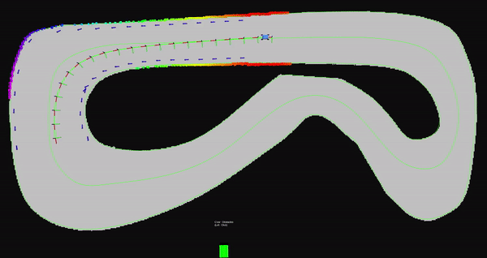
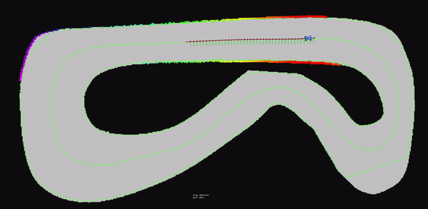
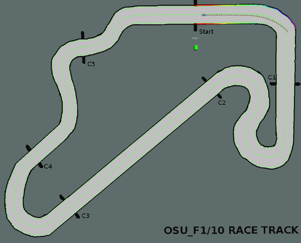
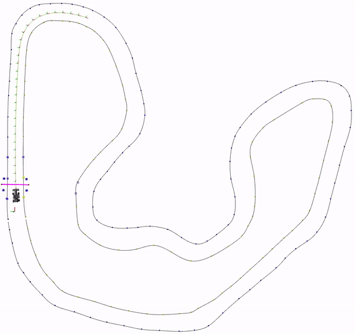

# Model Predictive Contouring Control for autonomous racing

This repo contains an implementation of model predictive contouring control (MPCC) based on the kinematic model of the car. Casadi framework is used for nonlinear mpcc problem formulation
and Ipopt solver with Harwell Subroutines Library(HSL) are used to solve the nonlinear optimization problem.
The controller is tested on two platforms: F1/10 platform and FSSIM simulator. 

## Problem Formulation
[The mathematical formulation for Nonlinear Kinematic MPCC can be found here.](nonlinear_mpc_casadi/docs/Kinematic_Nonlinear_MPCC.pdf).

## Casadi and Ipopt Setup

1. Installation on Intel processors equipped PC.
```shell
pip install casadi
```
>Install Ipopt from sources by following the instructions on https://github.com/casadi/casadi/wiki/InstallationLinux.

2. Installation on Nvidia Jetson TX2. 
Head to https://github.com/casadi/casadi/wiki/InstallationLinux and install Casadi from source following their instructions.
To avoid some build issues,install the following dependencies:
>Install clang and llvm using:
```shell
sudo apt-get install libclang-dev
sudo apt-get install llvm-dev
```

>Follow instructions to build IPOPT from source as well.
>Follow instructions on Adding Additional Linear Solvers section to use HSL libraries.
>Execute this while building casadi from source 
```shell
cmake -DWITH_PYTHON=ON -DWITH_SUNDIALS=OFF -DWITH_CSPARSE=OFF -DWITH_TINYXML=OFF -DWITH_IPOPT=ON -DWITH_CLANG=ON ..
```
3.  After everthing is set up,launch the F1/10 simulator if you want to test the node on the simulator.
```shell
roslaunch racecar_simulator simulator.launch
```
4. If the program is to be run on the actual F1/10 car, then launch particle filter on the car.
```shell
roslaunch nonlinear_mpc_casadi real_particle_filter.launch
```
Make sure you are loading appropriate map files in this launch file.

4. Launch the nonlinear MPCC node using appropriate launch file depending on whether you want to test
on the simulator or actual F1/10 car.
```shell
roslaunch nonlinear_mpc_casadi mpcc_f110_car.launch   ###FOR F1/10 car
roslaunch nonlinear_mpc_casadi mpcc_f110_simulator.launch  ###FOR F1/10 simualtor 
```

Few sample clips of the MPCC in F1/10 simulator are shown below.
 
In the first one, MPCC is allowed to 
drive the car as fast as possible within the limits of parameters set on yaml file. 
<p align="center">
  
</p>
In the second one, the lag and contouring weights are set identical so that MPCC prioritizes 
tracking precision over speed. 
<p align="center">
  
</p>

Here, MPCC is using only kinematic model of the car, but its full dynamic model can also be incorporated. The full
dynamic model is not included in the repo here as it is part of the competition codebase.

A sample clip showing the full dynamic model with tyre forces is shown below:

<p align="center">
  
</p>


[FSSIM](https://github.com/AMZ-Driverless/fssim) is a vehicle simulator dedicated for Formula Student Driverless Competition. 
It was developed for autonomous software testing purposes. You can find the installation and workspace setup instructions for the FSSIM 
interface in its repo [here](https://github.com/AMZ-Driverless/fssim).

After you have setup the FSSIM simulator, you can run MPCC on the car by simply running its launch file as follows,
```shell
roslaunch nonlinear_mpc_casadi mpcc_fssim.launch     
```

Few sample clips of the MPCC in operation on FSSIM are shown below. 
The parameters of the MPCC can be tuned in `mpc_params_fssim.yaml` file located in `params` folder inside the package.

<p align="center">
  
</p>
<p align="center">
  
</p>


## Nodes
### mpc_node

#### Published topics
- /(cmd_vel_topic_name) (ackermann_msgs/AckermannDriveStamped)
  - for sending driving command to the car
  - cmd_vel_topic_name: parameter in the mpc param file. (default: /car1_30m/vesc/high_level/ackermann_cmd_mux/input/nav_0)
- /mpc_trajectory (nav_msgs/Path)
  - Trajectory computed by mpc
- /boundary_marker (visualization_msgs/MarkerArray)
  - for visualizing path constraints
- /mpc_prediction (MPC_trajectory)
  - detailed information of mpc trajectory for reachability computation
- /mpc_metadata (MPC_metadata)
  - metadata of MPC for reachability computation
- /center_path (nav_msgs/Path)
  - Reference centerline path of the track for MPCC tracking
- /left_path (nav_msgs/Path)
  - Left boundary visualization for path constraints
- /right_path (nav_msgs/Path)
  - Right boundary visualization for path constraints
- /obstacle_marker (visualization_msgs/MarkerArray)
  - Elliptical marker for visualizing obstacles in the track

#### Subscribed topics
- /(goal_topic_name) (geometry_msgs/PoseStamped)
  - the goal can be given from the rviz or through the program itself to initiate the planning
  - goal_topic_name: parameter in the mpc param file. (default: /move_base_simple/goal)
- /(pose_topic_name) (geometry_msgs/PoseStamped)
  - pose of the robot extracted from particle filter or simulator 
  - pose_topic_name: parameter in the mpc param file. (default: /car1_30m/pf/viz/inferred_pose)
- /(odom_topic_name) (nav_msgs/Odometry)
  - robot odometry
  - odom_topic_name: parameter in the mpc param file. (default: /car1_30m/vesc/odom)

#### Parameters
##### Basic parameters
- controller_freq
  - main loop rate (default: 15 [Hz])
- car_frame
  - robot's coordinate frame (default: /car1_30m/base_link)
- dT
  - sampling time of MPC ( default: 0.1 [s])
- mpc_steps_N
  - Number of steps in the MPC prediction horizon (default: 15)
- vehicle_L
  - Wheelbase- distance betweeen front wheel and rear wheel (default:0.325 [m])
- car_width
  - Width of the car (default: 0.3 [m])
-mpc_max_steering
  - Maximum steering angle of the car(default: 0.418 [rad])
-mpc_max_throttle
  - Maximum acceleration of the car(default: 1 [m/s^2])
- max_speed
  - Maximum velocity of the car (default: 2 [m/s])
- path_folder_name
  - Folder name of the track data to be referenced in mpc(default: lab_track)
- lag_time
  - System lag time for executing controls(default: 0.1 [s])
- delay_mode
  - Whether to include system lag time in mpc computation(default: true)
- debug_mode
  - Display intermediate mpc calculations and timings(default: true)
  
  
##### MPCC weight-paramters 
- mpc_w_cte
  - Weight for penalizing cross-track error (default: 100) 
- mpc_w_lag
  - Weight for penalizing lag error (default: 700)   
- mpc_w_vel
  - Weight for penalizing use of actuator (default: 1.5) 
- mpc_w_p
  - Weight for prioritizing progress(centerline travelling velocity) along the path (default: 45.0) 
- mpc_w_delta
  - Weight for penalizing use of steering actuator (default: 41) 
- mpc_w_accel
  - Weight for penalizing high acceleration behavior (default: 50) 
- mpc_w_delta_d
  - Weight for penalizing rate of change of steering angle (default: 1500) 
  
